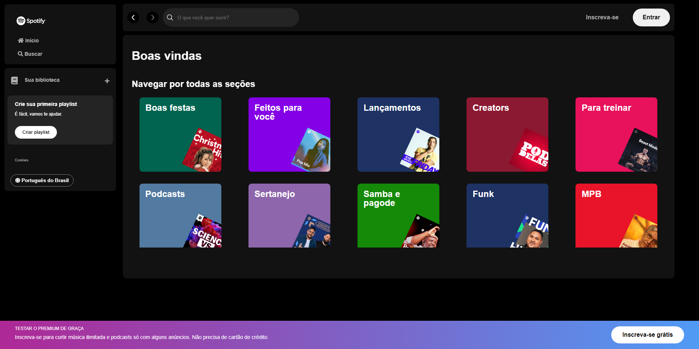

# Spotify Clone

Este é um projeto inspirado no visual do Spotify, desenvolvido durante a #ImersãoFrontEnd da #Alura.

## Descrição

O projeto consiste em um clone do Spotify, utilizando HTML, CSS e JS a aplicação front-end. O objetivo é criar uma interface semelhante ao Spotify, onde é possível visualizar artistas através de cards. Utilizei o [My Json Server](https://my-json-server.typicode.com/), permitindo que a aplicação continue realizando as requisições após o deploy, que foi feito na [Vercel](vercel.com/).

## Funcionalidades

- Busca de artistas por nome
- Exibição dos artistas encontrados em formato de cards

## Tecnologias Usadas

- HTML
- CSS
- Javascript
- Grid e Flex
- Consumindo API
- Biblioteca Json-Server

## Link do projeto

[Clique aqui para visitar o projeto!](https://spotify-clone-eta-gold.vercel.app)

### Preview

## Instrutores e instrutoras da alura nessa imersão
- Guilherme Lima - Alura
- Fernanda Degolin - Desenvolvedora Front-end na Globo
- Mayara Cardoso - Desenvolvedora Front-end no Itaú

## Como executar o projeto

1. Clone este repositório
2. Instale as dependências do projeto utilizando o comando `npm install -g json-server@0.17.4  `
3. Execute o json-server com o comando `json-server --watch api-artists/artists.json --port 3000`
3. Abrir o arquivo `index.html` com o navegador.

## Autor do Projeto

- Matheus Souza
- Linkedin: https://www.linkedin.com/in/matheusg-souza/
